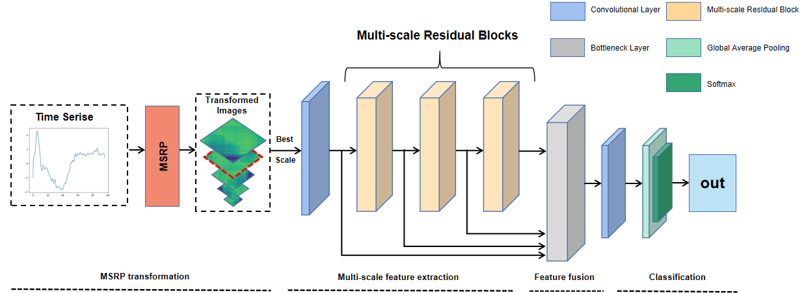

#Feature-fused residual network for time series classification
This is the project of paper 'Feature-fused residual network for time series classification'.

##Algorithm Introduction
This paper proposes a feature fusion residual network method (FFRN) combined with multi-scale signed RP (MSRP). FFRN extracts and fuses multi-scale features using multi-scale modules, and then globally fuses features from all layers with different scales and levels of precision using residual connections. The effectiveness of this method has been demonstrated through experiments on 43 datasets from the UCR time series classification archive.The contributions of this paper are summarized as follows:

1. To accommodate feature extraction at various scales, a multi-scale feature extraction network with residual connections is presented.

2. This network's feature fusion module can combine feature maps of various layers and precisions to create higher-precision images, which enhances the image quality.

3. Our proposed MSRP-FFRN achieves state-of-the-art performance on 43 UCR datasets. The effectiveness of each component of the method was verified by ablation experiments.

##Prerequisite

Tested on Windows 10, with Python 3.8, PyTorch 1.9.0, CUDA 11.1, and 1x NVIDIA RTX 3090.

##Data Transformation

The original data used in this project comes from the UCR archive, which contains the 45 univariate time series datasets. This project transforms these data into MSRP images for better discrimination.

* Transform to MSRP images.

>Click on MSRP_Transform.py and run it. Or python MSRP_Transform.py

* Transform to RP images.
>Click on RP_Transform.py and run it. Or python RP_Transform.py

* Transform to TRP (Threshhold RP) images.
>Click on TRP_Transform.py and run it. Or python TRP_Transform.py

##Code

The code is divided as follows:

* The main.py python file contains the necessary code to run all experiements.

* The utils folder contains the necessary functions to read the datasets and manipulate the data.

* The classifiers folder contains eight python files one for each deep individual/ensemble classifier presented in our paper.

To run a model on all datasets you should issue the following command:

>Click on main.py and run it. Adjust the hyperparameters in the constant file.

Or:

(1). Train

`python main.py --flag_train_or_test Train --ITERATIONS 1 --UNIVARIATE_ARCHIVE_NAMES MSRP_UCR_Archive --UNIVARIATE_DATASET_NAMES Coffee --CLASSIFIERS FFRN_torch --BATCH_SIZE 16 --EPOCH 1500 --model_save_interval 500 --LR 0.00005 --test_split 8`

(2). Test

`python main.py --flag_train_or_test Test --UNIVARIATE_ARCHIVE_NAMES MSRP_UCR_Archive --UNIVARIATE_DATASET_NAMES Coffee --CLASSIFIERS FFRN_torch --EPOCH 1500 --model_save_interval 500 --test_split 8`

*This code is partially borrowed from Ye Zhang, thanks for Zhang's help.

##Referrence
Zhang Y, Hou Y, OuYang K, et al. Multi-scale signed recurrence plot based time series classification using inception architectural networks[J]. Pattern Recognition, 2022, 123: 108385.

